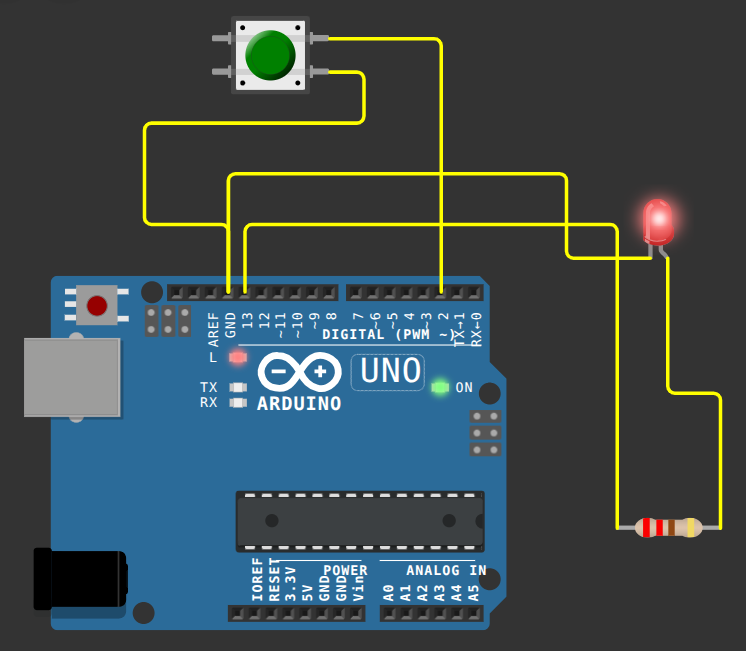

# 💡 Project Title: *Smart Touch-Controlled Light with Energy Monitoring*

<p align="center">


</p>

A smart lighting system built using **Arduino UNO** and a **Touch Sensor (TTP223)**. The project provides touch-based light control, automatic energy saving, usage monitoring, energy consumption estimation, and smart analytics through the Serial Monitor.

---

# 🎓 Course Information

| Item | Details |
|------|---------|
| Course Title | Microprocessor and Interfacing Lab |
| Course ID | CSE 0714 3178 |
| Credits | 1.5 |
| Semester | 3rd Year, 1st Semester |

---

# 📖 Project Introduction

The main goal of this project is to build a smart light control system using an Arduino UNO and a touch sensor.

A user can turn the LED ON or OFF by simply touching the sensor.

Unlike a normal touch-controlled light, this project automatically turns the light OFF after inactivity, warns the user before shutdown, tracks usage statistics, estimates energy consumption, and calculates electricity cost.

This project demonstrates how software can make a simple lighting system smarter without requiring additional hardware.

---

# 🛠 Hardware Used

- Arduino UNO R3
- TTP223 Touch Sensor
- LED
- 220Ω Resistor
- Breadboard
- Jumper Wires
- USB Cable

---

# 💻 Software Used

- Arduino IDE
- C++
- Wokwi Simulator

---

# 📂 Repository Structure

```text
.
├── README.md
├── SmartTouchLight.ino
├── sketch.ino
├── diagram.json
├── circuit_wokwi.png
└── wokwi-project.txt
```

---

# ▶️ How to Run

## Arduino IDE

1. Open `SmartTouchLight.ino`
2. Select Arduino UNO
3. Upload the code
4. Open Serial Monitor
5. Baud Rate = **9600**

---

## Wokwi

1. Open the Wokwi project link.
2. Click ▶ Start Simulation.
3. Press the touch button.
4. Observe the LED behavior.
5. Open the Serial Monitor to view analytics.

---

# 🔌 Circuit Connections

| Component | Arduino Pin |
|------------|-------------|
| Touch Sensor OUT | D7 |
| LED (+) | D13 |
| LED (-) | GND (through 220Ω resistor) |
| Touch Sensor VCC | 5V |
| Touch Sensor GND | GND |

---

# 📸 Project Preview

## Wokwi Circuit

<p align="center">

</p>

---

# 🔗 Wokwi Simulation

You can run the complete project online without any hardware.

**Simulation Link**

https://wokwi.com/projects/469553316004649985

---

# ✨ Features

## 1. Touch-Controlled Light

- Touch once → LED turns **ON**
- Touch again → LED turns **OFF**

This replaces a traditional switch with a modern touch sensor.

---

## 2. Auto OFF (Energy Saving)

When the LED turns ON, a **30-second timer** starts automatically.

If no touch is detected within 30 seconds, the LED turns OFF automatically to save electricity.

---

## 3. Smart Reminder

After **25 seconds**, the Serial Monitor displays:

```text
WARNING!

Auto OFF in 5 seconds...
```

Countdown:

```text
5
4
3
2
1
```

---

## 4. Sleep Mode

During the last 5 seconds:

- LED blinks slowly.
- Touching the sensor resets the timer.
- If no touch is detected, the LED turns OFF automatically.

---

## 5. Touch Counter

Every successful touch is counted.

Example:

```text
Touch Count : 1
Touch Count : 2
Touch Count : 3
```

---

## 6. Total ON Time

The Arduino records how long the LED stays ON.

Example:

```text
Current Session

35 seconds

-------------------

Total ON Time

7 minutes 35 seconds
```

---

## 7. Energy Consumption

The system estimates the electrical energy used by the LED.

Example:

```text
Energy Used

0.005 Wh
```

Formula:

```text
Energy = Power × Time
```

---

## 8. Estimated Electricity Cost

The system estimates the electricity cost based on the calculated energy consumption.

Example:

```text
Estimated Cost

0.00006 Tk
```

---

## 9. Auto OFF Counter

Every automatic shutdown increases the Auto OFF counter.

Example:

```text
Auto OFF Events

8
```

---

## 10. Smart Light Analytics

The system stores:

- Touch Count
- Total ON Time
- Average Session Time
- Energy Used
- Estimated Cost
- Auto OFF Count

---

# 🖥 Serial Monitor Commands

## `report`

Displays the current monitoring statistics.

Example:

```text
========================================
SMART LIGHT ANALYTICS
========================================

Current Monitoring Session

Touch Count          : 18
Total ON Time        : 12m 25s
Energy Used          : 0.008 Wh
Estimated Cost       : 0.00010 Tk
Auto OFF Events      : 6
Average Session Time : 41 sec

========================================
```

---

## `reset`

Ends the current monitoring session.

The Arduino:

1. Prints the final report.
2. Clears all statistics.
3. Starts a new monitoring session.

Example:

```text
========================================
SMART LIGHT ANALYTICS
========================================

Monitoring Session Ended

Touch Count          : 48
Total ON Time        : 1h 12m 45s
Energy Used          : 0.050 Wh
Estimated Cost       : 0.00060 Tk
Auto OFF Events      : 15
Average Session Time : 1m 30s

========================================

Manual Reset Requested...

Statistics Cleared Successfully.

New Monitoring Session Started.
```

---

# ⏰ Automatic 24-Hour Report

After the Arduino has been running continuously for **24 hours**, it automatically prints a complete analytics report.

Example:

```text
========================================
SMART LIGHT ANALYTICS
========================================

24-Hour Monitoring Completed

Touch Count          : 87
Total ON Time        : 3h 28m 15s
Energy Used          : 0.144 Wh
Estimated Cost       : 0.00173 Tk
Auto OFF Events      : 27
Average Session Time : 2m 24s

========================================

24-Hour Session Completed.

Statistics Reset Automatically.

New Monitoring Session Started.
```

---

# 🔄 System Workflow

```text
Power ON
    │
    ▼
Arduino Starts
    │
    ▼
Wait for Touch
    │
    ▼
Touch Detected
    │
    ▼
LED ON
    │
    ▼
30 Second Timer Starts
    │
    ▼
25 Seconds
    │
    ▼
Warning Countdown
5
4
3
2
1
    │
 ┌──┴───────────┐
 │              │
 ▼              ▼
Touch Again    No Touch
 │              │
 ▼              ▼
Reset Timer    Sleep Mode
 │              │
 └──────────► LED OFF
```

---

# 📊 Statistics Collected

The system records:

- Number of Touches
- Total LED ON Time
- Average Session Time
- Energy Used (Wh)
- Estimated Electricity Cost
- Auto OFF Events

---

# ⚡ Energy Calculation

Formula:

```text
Energy = Power × Time
```

Example:

LED Power

```text
0.04 Watt
```

LED ON Time

```text
2 Minutes
```

Energy Used

```text
0.00133 Wh
```

Estimated Cost

```text
0.000016 Tk
```

---

# 🎯 Applications

- Smart Home
- Smart Bedroom
- Smart Hostel Room
- Smart Classroom
- Smart Office
- Energy Saving
- Automatic Light Control
- Educational Demonstration
- Embedded Systems Learning

---

# 🌟 Project Innovation

This project combines **smart control**, **energy saving**, and **usage monitoring** into one system.

The system can:

- Turn the light ON and OFF using a touch sensor.
- Automatically turn OFF the light after inactivity.
- Warn the user before automatic shutdown.
- Allow the user to keep the light ON by touching the sensor during the countdown.
- Count every touch.
- Measure total ON time.
- Estimate energy consumption.
- Estimate electricity cost.
- Generate Smart Light Analytics.
- Automatically reset statistics every 24 hours.
- Allow manual report generation and reset.

---

# 📝 Conclusion

The **Smart Touch-Controlled Light with Energy Monitoring** is a simple, practical, and energy-efficient embedded systems project.

Although the hardware is simple, software makes the system intelligent by adding automation, monitoring, and analytics.

The project demonstrates

- Digital Input/Output
- Timer Programming
- State Machine Design
- Energy Saving
- Usage Monitoring
- Data Analysis
- Serial Communication

---

# 👨‍💻 Team Information

**Team Name:** `Group_05_Section_A`

| Name | Registration No. |
|------|------------------|
| Md Shajjadul Ferdous | 2022331015 |
| Autanu Datta | 2022331053 |
| Taposh Kumer Ghosh | 2022331089 |
| Rahad Islam | 2022331097 |

---

# 📜 License

This project was developed for the **Microprocessor and Interfacing Lab (CSE 0714)** course for academic and educational purposes.
